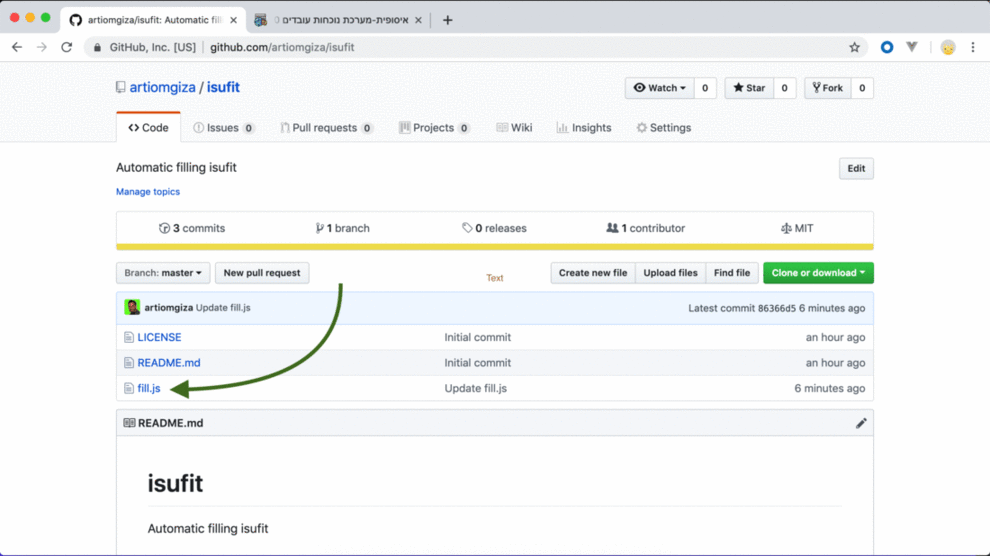

# isufit
Automatic filling isufit

1. Copy js from `fill.js` file
2. Open Isufit
3. Right click on one of the lines --> `inspect` (IMPORTANT!!!)
4. console tab --> paste --> enter

Notes:
- might override existing values
- please review the values before submitting
- might contain bugs :)
